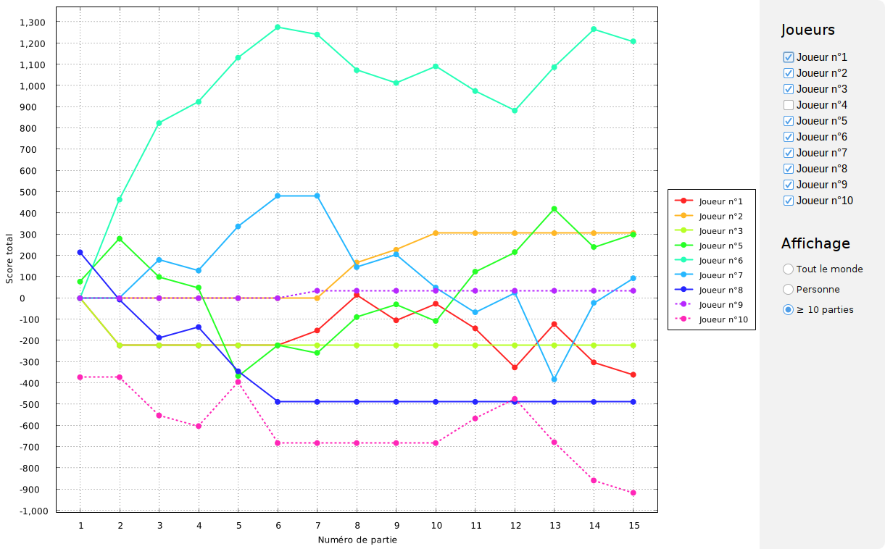

# Tarot – Compteur de points

Cette application permet de comptabiliser des parties de tarot à 3, 4, et 5 joueurs, et de créer
automatiquement les classements associés à partir des données fournies.

## Règles du jeu

Cliquez [ici](RULES.md) pour consulter les règles détaillées du jeu suivies par notre groupe.

## Ajout d'une partie

L'interface suivante permet de comptabiliser une partie en fonction des joueurs existants via la rubrique `Ajouter`. Chaque partie peut ensuite être modifiée ou supprimée dans le menu principal.

## Statistiques et graphiques

Pour chaque nombre $N$ de joueurs, une rubrique `Tarot à N` propose des statistiques individuelles, des statistiques globales sur un mois ou entre deux parties précises de ce mois, ainsi que des graphiques représentant l'évolution des scores entre deux parties.

_Par défaut, seules les courbes des personnes ayant joué plus de 10 parties sur la période sélectionnée sont affichées._

## Export des données

### Grille des scores

Lorsque vous cliquez sur `Exporter les données` dans la rubrique `Données` ou entrez `CTRL+E`, l'application crée un tableur pour chaque année, chacun contenant une grille par mois contenant au moins une partie. Des statistiques individuelles, des classements et des statistiques globales sont affichées pour chaque nombre de joueurs.

### Sauvegardes

Lorsque vous cliquez sur `Créer une sauvegarde` dans la rubrique `Données` ou entrez `CTRL+S`, l'application crée une copie des fichiers des parties et des joueurs dans une archive au format ZIP.
