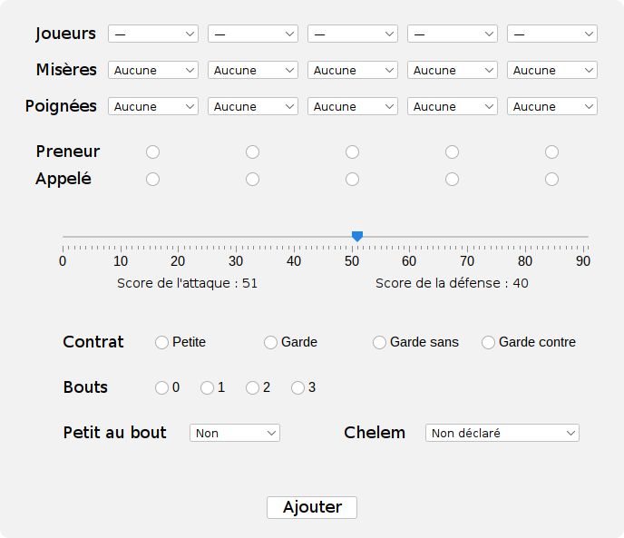

# Tarot – Compteur de points

Cette application permet de comptabiliser des parties de tarot à 3, 4, et 5 joueurs, et de créer
automatiquement les classements associés à partir des données fournies.

## Ajout d'une partie

L'interface suivante permet de comptabiliser une partie en fonction des joueurs ajoutés.

## Calcul des points

En fin de partie, les points obtenus dans les plis de l'attaque sont comparés au score requis par
le nombre de bouts qu'elle a récoltés.

| **Bouts** | **Score requis** |
|-----------|------------------|
| 0         | 56               |
| 1         | 51               |
| 2         | 41               |
| 3         | 36               |

Chaque contrat est associé à un multiplicateur de score différent.

| **Contrat**  | **Multiplicateur**  |
|--------------|---------------------|
| Petite       | 1                   |
| Garde        | 2                   |
| Garde sans   | 4                   |
| Garde contre | 6                   |

Ainsi, en notant :
- $a$ le score obtenu par l'attaque,
- $b$ le score requis en fonction des bouts,
- $m$ le multiplicateur du contrat,

alors le nombre de points attribué à l'attaque vaut $(25 + |a - b|) \times m$,
multiplié par $-1$ lorsque le contrat est chuté. Il est alors possible de retrouver le score obtenu par l'attaque à partir du score
final $f$ qui lui a été attribué :
- $f / m + b - 25$ si le contrat a été réussi,
- $b + 25 - f / m$ si le contrat a été chuté.

À 3 et 4 joueurs, chaque défenseur perd $f$ points et le preneur en gagne $3f$.

À 5 joueurs, chaque défenseur perd $f$ points, le preneur en gagne $2f$ et son allié
en gagne $f$. Si le preneur s'est appelé tout seul, il obtient $4f$ points.

## Misères

Lorsqu'un joueur n'a pas d'atout ou pas de tête, il peut déclarer une _misère_ (_simple_ si
l'une des conditions seulement est vérifiée, _double_ si les deux sont remplies). En fin
de partie, tous les autres joueurs lui offrent un certain nombre de points, indépendamment
de leur camp. Cette prime n'est pas affectée par le multiplicateur du contrat.

| **Misère** | **Prime** |
|------------|-----------|
| Simple     | 10 points |
| Double     | 20 points |

_NB : la misère doit nécessairement être annoncée lorsque le joueur pose sa première carte._

## Poignées

Lorsqu'un joueur possède un certain nombre d'atouts, il peut déclarer une _poignée_
(simple, double, ou triple).

| **Poignée** | **Atouts (5j)** | **Atouts (4j)** | **Atouts (3j)** | **Prime** |
|-------------|-----------------|-----------------|-----------------|-----------|
| Simple      | 8               | 10              | 13              | 20 points |
| Double      | 10              | 13              | 15              | 30 points |
| Triple      | 13              | 15              | 18              | 40 points |

Les points reviennent en positif à l'attaque si et seulement si le contrat a été réussi.
Cette prime n'est pas affectée par le multiplicateur du contrat.

_NB : la poignée doit nécessairement être annoncée lorsque le joueur pose sa première carte._

## Petit au bout

Lorsque le dernier pli est remporté grâce au Petit par un joueur, une prime de 10 points est
accordée au camp de ce joueur. Cette prime est affectée par le multiplicateur du contrat,
et **ne dépend pas du camp** (si le contrat est chuté mais l'attaque mène le Petit au bout,
la prime reviendra en positif à l'attaque).
